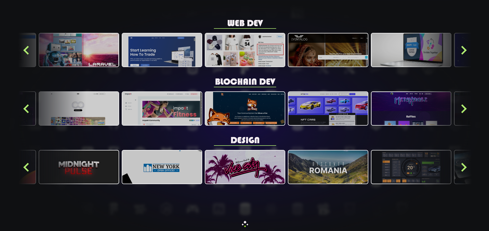

<h2 align="center">
  Hey there  ,
</h2>

<!-- 
 -->

  <!-- 
  
  
   -->
  <!--  -->

  <!-- 
  
  
  
   -->

  
  

<h3 align="center"> Tech & Tools</h3>

 
  <table>
    <tr>
      <td valign="center" width="100px"><b>Frontend<b></td>
      <td valign="center" width="100px"><b>Backend<b></td>
      <td valign="center" width="100px"><b>CLoud<b></td>
    </tr>
    <tr>
      <td valign="center" align="center" width="300px">
         
         
         
        
         
        
         
         
         
         
        
      </td>      
      <td valign="center" align="center" width="300px">
         
         
                
         
         
         
         
         
         
      </td>
      <td valign="center" align="center" width="300px">
         
         
         
         
         
         
      </td>
    </tr>
  </table>
  
 <table>
    <tr>
      <td valign="center" width="100px"><b>Blockchain<b></td>
      <td valign="center" width="100px"><b>DataBase<b></td>
    </tr>
    <tr>
      <td valign="center" align="center" width="300px">
         
         
         
         
         
         
         
        
      </td>
      <td valign="center" align="center" width="300px">
         
         
         
         
         
         
      </td>
    </tr>
  </table>

  <!--  -->
  &nbsp;&nbsp;
  
  &nbsp;&nbsp;
  
  &nbsp;&nbsp;
  <!--  -->
  

<h2 align="center"> Thanks for visiting my profile. </h2>

  

  

